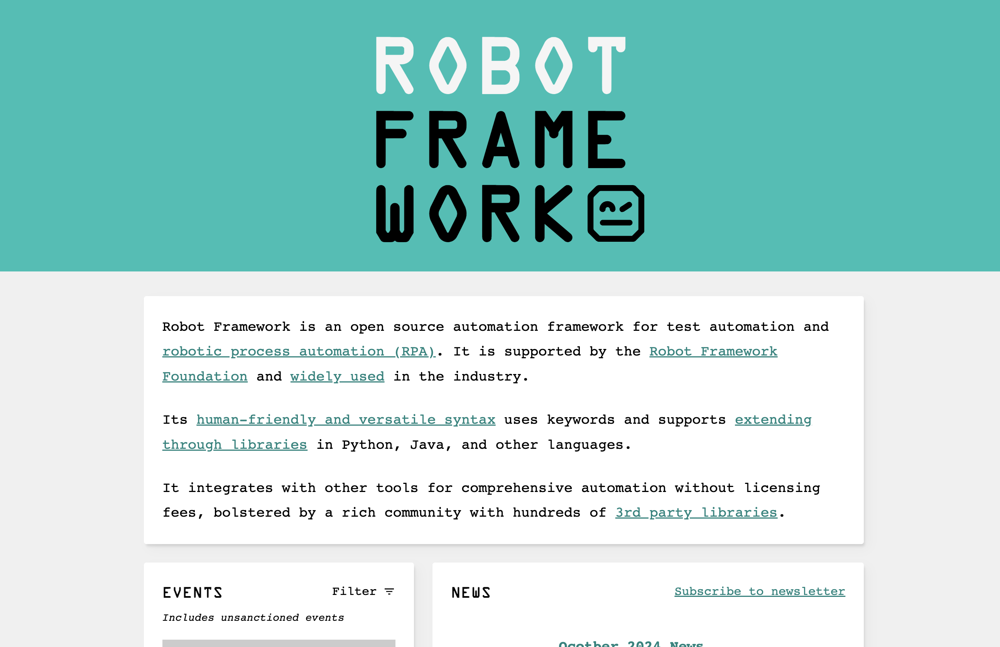

# Robotframework-Seleniumlibrary Part 01



## Flow vs 3As

| Flow     | 3As       |
| -------- | --------- |
| Setup    | Arrange   |
| Act      | Act       |
| Validate | Assert    |
| TearDown | [Cleanup] |

---

## Test Data Sections

```robot
*** Settings ***


*** Variables ***


*** Test Cases ***


*** Keywords ***

```

| Section                                                                            | Used for                                                                                                                            |
| :--------------------------------------------------------------------------------- | :---------------------------------------------------------------------------------------------------------------------------------- |
| [Settings](https://docs.robotframework.org/docs/style_guide#settings)              | 1) Importing `test libraries`, `resource files` and `variable files`. <br/>2) Defining metadata for `test suites` and `test cases`. |
| [Variables](https://docs.robotframework.org/docs/style_guide#variables)            | Defining `variables` that can be used elsewhere in the test data.                                                                   |
| [Test Cases](https://docs.robotframework.org/docs/style_guide#test-cases-or-tasks) | `Creating test cases` from available keywords.                                                                                      |
| [Keywords](https://docs.robotframework.org/docs/style_guide#keyword)               | `Creating user keywords` from existing lower-level keywords                                                                         |

## In Action

1. Create file call `google.robot` with following code

   ```robot
   *** Settings ***


   *** Variables ***


   *** Test Cases ***
   ทดสอบค้นหา PIM ควรจะต้องเจอ สถาบันการจัดการปัญญาภิวัฒน์
       Open Browser    url=https://www.google.com    browser=chrome
       Input Text    id=APjFqb    text=PIM
       Press Keys    None    RETURN
       Wait Until Page Contains    สถาบันการจัดการปัญญาภิวัฒน์


   *** Keywords ***

   ```

   > [robotframework-seleniumlibrary](https://robotframework.org/SeleniumLibrary/SeleniumLibrary.html)

2. Run Test

   ```sh
   robot google.robot
   ```

## Additional Tools

- [robotidy](https://robotidy.readthedocs.io/en/stable/)

  ```sh
  pip install robotframework-tidy
  ```

## VSCode Extensions

- [RobotCode](https://robotcode.io/)
